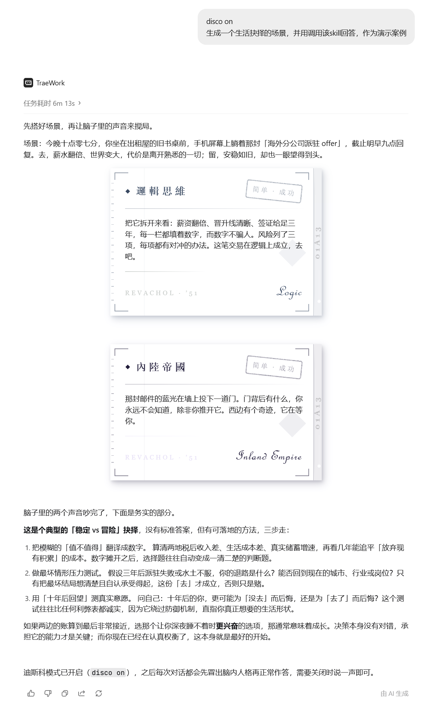
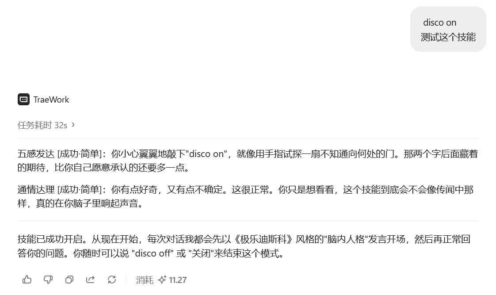

# 极乐迪斯科 24 Personalities Skill

 

> *"The furies are at home, in the mirror; 
> it is their address. 
> Even the clearest water, 
> if deep enough can drown." 
> -- R. S. Thomas*

## 简介

**功能介绍**：以《极乐迪斯科》（Disco Elysium）24 人格系统为原型的 AI 对话 Skill。触发后，先从 24 个人格中选出 1~2 个最合适的对用户说话，再以普通助手口吻正常、完整地回答用户的问题。

**Trigger**

- `disco:on`/`disco on`：开启该 skill，默认不开启内联渲染
  - skill 会保持开启直到用户明确要求关闭
- `html:on`/`html on`：开启内联渲染，样式见下

**如何开始**

- **该版本为All in One版本**，只需安装单一的 SKILL 文件即可，24人格的语料包及内联渲染样式已含在 skill内的 `references` 和 `templates` 文件夹中
- 下载 Release 中的 `.skill` 文件，安装即可开始使用

## 示例

**内联渲染开启：**

 

**内联渲染关闭：**

## 其他信息

- 类似 SKILL：[disco-elysium](https://github.com/liigoQi/disco-elysium)
- `scripts` 文件夹下脚本用于提取并分类24个人格的语料，生成 `references` 文件夹下的相应文件内的语料
- 未来更新计划详见[ROADMAP](./ROADMAP.md)
