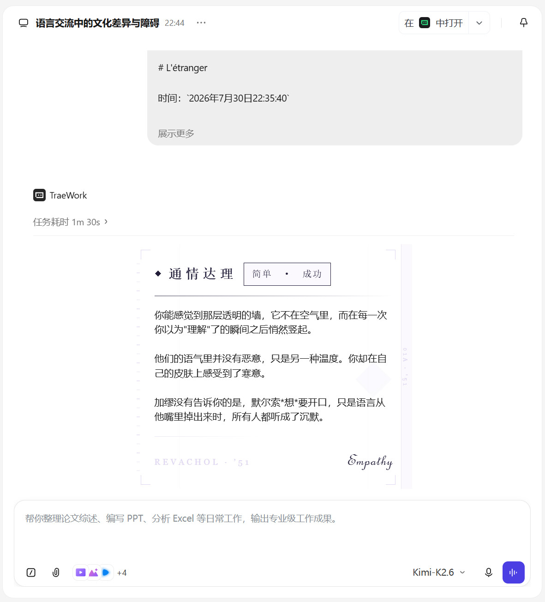

# 极乐迪斯科 24 Personalities Skill

> *"The furies are at home, in the mirror; 
> it is their address.
> Even the clearest water,
> if deep enough can drown."
> -- R. S. Thomas*

## 简介

**功能介绍**：以《极乐迪斯科》（Disco Elysium）24 人格系统为原型的 AI 对话 Skill。触发后，先从 24 个人格中选出 1~2 个最合适的对用户说话，再以普通助手口吻正常、完整地回答用户的问题。

**如何开始**

- **该版本为All in One版本**，只需安装单一的 SKILL 文件即可，24人格的语料包含在 `references` 文件夹中
- 下载 Release 中的 `.skill` 文件，安装即可开始使用

## 示例

## 其他信息

- 类似 SKILL：[disco-elysium](https://github.com/liigoQi/disco-elysium)
- `scripts` 文件夹下脚本用于提取并分类24个人格的语料，生成 `references` 文件夹下的相应文件内的语料
- 未来更新计划详见[ROADMAP](./ROADMAP.md)
